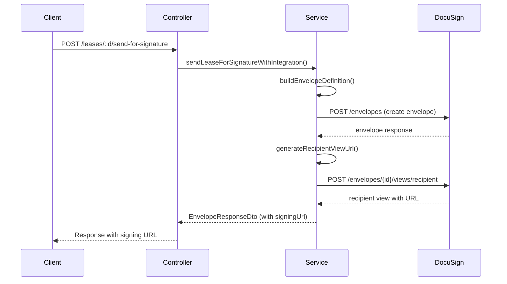

# Design Document: DocuSign Signing URL in API Response

## Overview

This design adds the recipient signing URL to the API response when creating a DocuSign envelope via the "send-for-signature" endpoint. After successfully creating an envelope, the system will call the DocuSign Recipient View API to generate a signing URL and include it in the response. This enables alternative delivery methods beyond email and provides immediate access to the signing interface.

The implementation will:
1. Generate a recipient view URL after envelope creation
2. Add a `signingUrl` field to the `EnvelopeResponseDto`
3. Handle errors gracefully to ensure envelope creation succeeds even if URL generation fails
4. Provide comprehensive logging for debugging

## Architecture

### High-Level Flow



### Component Interaction

The feature involves three main components:

1. **DocuSignService**: Core service that creates envelopes and generates recipient view URLs
2. **EnvelopeResponseDto**: Data transfer object that includes the signing URL
3. **DocuSignController**: API endpoint that orchestrates the flow

## Components and Interfaces

### 1. EnvelopeResponseDto (Updated)

The DTO will be extended to include an optional `signingUrl` field:

```typescript
export class EnvelopeResponseDto {
  @IsString()
  envelopeId: string;

  @IsString()
  status: string;

  @IsString()
  statusDateTime: string;

  @IsString()
  uri: string;

  @IsString()
  @IsOptional()
  signingUrl?: string;
}
```

### 2. RecipientViewRequest Interface

A new interface to represent the DocuSign recipient view request:

```typescript
interface RecipientViewRequest {
  returnUrl: string;
  authenticationMethod: string;
  email: string;
  userName: string;
  clientUserId?: string;
}
```

### 3. RecipientViewResponse Interface

A new interface to represent the DocuSign recipient view response:

```typescript
interface RecipientViewResponse {
  url: string;
}
```

### 4. DocuSignService Methods

#### New Method: `generateRecipientViewUrl()`

```typescript
private async generateRecipientViewUrl(
  envelopeId: string,
  recipientEmail: string,
  recipientName: string,
): Promise<string | null>
```

This method will:
- Create a recipient view request with the recipient's information
- Call the DocuSign API to generate the signing URL
- Return the URL on success, or null on failure
- Log errors without throwing exceptions

#### Updated Method: `sendLeaseForSignature()`

The existing method will be updated to:
- Call `generateRecipientViewUrl()` after successful envelope creation
- Include the signing URL in the returned `EnvelopeResponseDto`
- Continue successfully even if URL generation fails

## Data Models

### Environment Configuration

New optional environment variable:

```
DOCUSIGN_RETURN_URL=https://your-app.com/signing-complete
```

This URL is where DocuSign will redirect users after they complete signing. If not provided, a default value will be used.

### API Response Structure

```json
{
  "envelopeId": "57d72bea-4a22-810b-81ac-544fec23191f",
  "status": "sent",
  "statusDateTime": "2024-01-15T10:30:00Z",
  "uri": "/envelopes/57d72bea-4a22-810b-81ac-544fec23191f",
  "signingUrl": "https://demo.docusign.net/Signing/StartInSession.aspx?t=..."
}
```

If signing URL generation fails, the `signingUrl` field will be omitted or set to `null`.

## Implementation Details

### Recipient View Generation

The DocuSign Recipient View API requires:

1. **Envelope ID**: The ID of the created envelope
2. **Recipient Information**: Email and name matching the signer in the envelope
3. **Return URL**: Where to redirect after signing
4. **Authentication Method**: Set to 'email' for email-based authentication

The API endpoint is:
```
POST /v2.1/accounts/{accountId}/envelopes/{envelopeId}/views/recipient
```

### Error Handling Strategy

The implementation uses a "fail-safe" approach:

1. **Envelope Creation**: Must succeed (existing behavior)
2. **URL Generation**: Failures are logged but don't fail the request
3. **Response**: Always includes envelope details; signing URL is optional

This ensures that the core functionality (envelope creation and email delivery) is not affected by URL generation issues.

### Configuration

The return URL will be configurable via environment variable with a sensible default:

```typescript
const returnUrl = this.configService.get<string>('DOCUSIGN_RETURN_URL') 
  || 'https://www.docusign.com/deeplinkRedirect';
```

The default URL is DocuSign's standard redirect page that shows a completion message.


## Correctness Properties

A property is a characteristic or behavior that should hold true across all valid executions of a system—essentially, a formal statement about what the system should do. Properties serve as the bridge between human-readable specifications and machine-verifiable correctness guarantees.

### Property 1: Recipient View Generation with Correct Parameters

*For any* successfully created envelope with valid recipient information (email and name), when the system generates a recipient view URL, the request to DocuSign SHALL include the envelope ID, recipient email, recipient name, a configured return URL, and authentication method set to 'email'.

**Validates: Requirements 1.1, 1.2, 1.3, 4.1, 4.3**

### Property 2: API Response Structure Based on URL Generation Success

*For any* envelope creation request, when the signing URL is successfully generated, the API response SHALL include a `signingUrl` field containing the complete URL; when URL generation fails, the API response SHALL either omit the `signingUrl` field or set it to null, while still including all other envelope fields (envelopeId, status, statusDateTime, uri).

**Validates: Requirements 2.1, 2.2, 2.3**

### Property 3: DTO Validation for Signing URL

*For any* EnvelopeResponseDto instance, when the `signingUrl` field is present, it SHALL be either a valid URL string or undefined/null, and validation SHALL reject any other value types.

**Validates: Requirements 2.4, 3.3**

### Property 4: Backward Compatibility of Response Fields

*For any* envelope creation response, the EnvelopeResponseDto SHALL always include the fields `envelopeId`, `status`, `statusDateTime`, and `uri` with valid values, regardless of whether the `signingUrl` field is present.

**Validates: Requirements 3.4**

### Property 5: Error Handling Preserves Envelope Creation

*For any* envelope creation request, when the recipient view URL generation fails (due to API errors, network issues, or invalid parameters), the service SHALL log the error, continue execution, and return a valid EnvelopeResponseDto without throwing an exception that would fail the entire request.

**Validates: Requirements 1.4, 5.1, 5.2, 5.3, 5.4**

### Property 6: Comprehensive Logging for URL Generation

*For any* recipient view URL generation attempt, the service SHALL log the envelope ID and recipient email before making the request; when successful, SHALL log the generated URL (or truncated version) and a success message; when errors occur, SHALL log the full error details with context including envelope ID and recipient email.

**Validates: Requirements 6.1, 6.2, 6.3, 6.4**

## Error Handling

### Error Categories

1. **Envelope Creation Errors** (Critical - Request Fails)
   - Invalid PDF buffer
   - Missing recipient email
   - DocuSign API errors during envelope creation
   - Authentication failures

2. **URL Generation Errors** (Non-Critical - Request Succeeds)
   - DocuSign API errors during recipient view creation
   - Network timeouts
   - Invalid recipient information
   - Missing envelope ID

### Error Handling Strategy

```typescript
try {
  // Create envelope (critical - must succeed)
  const envelopeResponse = await createEnvelope(...);
  
  try {
    // Generate signing URL (non-critical - can fail)
    const signingUrl = await generateRecipientViewUrl(...);
    envelopeResponse.signingUrl = signingUrl;
  } catch (urlError) {
    // Log error but don't fail the request
    this.logger.error('Failed to generate signing URL', {
      envelopeId: envelopeResponse.envelopeId,
      recipientEmail,
      error: urlError.message
    });
    // signingUrl remains undefined
  }
  
  return envelopeResponse;
} catch (envelopeError) {
  // Envelope creation failed - propagate error
  throw envelopeError;
}
```

### Error Messages

- **URL Generation Failure**: "Failed to generate signing URL for envelope {envelopeId}: {error message}"
- **Missing Configuration**: "DOCUSIGN_RETURN_URL not configured, using default"
- **Invalid Recipient**: "Recipient information mismatch for envelope {envelopeId}"

## Testing Strategy

### Unit Tests

Unit tests will focus on specific examples and edge cases:

1. **DTO Validation Tests**
   - Valid signing URL string
   - Null signing URL
   - Undefined signing URL
   - Invalid URL format (should fail validation)
   - All required fields present

2. **Error Handling Tests**
   - URL generation failure doesn't throw exception
   - Envelope response returned without signing URL on failure
   - Error logging includes required context

3. **Configuration Tests**
   - Custom return URL from environment
   - Default return URL when not configured
   - Authentication method set correctly

### Property-Based Tests

Property-based tests will verify universal properties across many generated inputs. Each test should run a minimum of 100 iterations.

1. **Property 1: Recipient View Request Structure**
   - Generate random envelope IDs, emails, and names
   - Verify request always includes all required fields
   - Tag: **Feature: docusign-email-notification-fix, Property 1: Recipient view generation with correct parameters**

2. **Property 2: Response Structure Consistency**
   - Generate random envelope responses with/without signing URLs
   - Verify response structure matches expected format
   - Tag: **Feature: docusign-email-notification-fix, Property 2: API response structure based on URL generation success**

3. **Property 3: DTO Validation**
   - Generate random DTO instances with various signingUrl values
   - Verify validation accepts valid URLs and null/undefined
   - Verify validation rejects invalid values
   - Tag: **Feature: docusign-email-notification-fix, Property 3: DTO validation for signing URL**

4. **Property 4: Backward Compatibility**
   - Generate random envelope responses
   - Verify all legacy fields always present
   - Tag: **Feature: docusign-email-notification-fix, Property 4: Backward compatibility of response fields**

5. **Property 5: Error Resilience**
   - Generate random error scenarios during URL generation
   - Verify envelope response always returned
   - Verify no exceptions thrown
   - Tag: **Feature: docusign-email-notification-fix, Property 5: Error handling preserves envelope creation**

6. **Property 6: Logging Completeness**
   - Generate random success and failure scenarios
   - Verify logs contain required information
   - Tag: **Feature: docusign-email-notification-fix, Property 6: Comprehensive logging for URL generation**

### Integration Tests

Integration tests will verify the complete flow with DocuSign API:

1. **Successful Flow**
   - Create envelope with valid data
   - Verify signing URL is generated
   - Verify response includes signing URL
   - Verify URL is accessible

2. **Failure Recovery**
   - Simulate DocuSign API failure for recipient view
   - Verify envelope creation still succeeds
   - Verify response doesn't include signing URL

3. **Configuration Variations**
   - Test with custom return URL
   - Test with default return URL
   - Verify correct URL used in requests

### Testing Framework

- **Unit Tests**: Jest (existing framework)
- **Property-Based Tests**: fast-check (TypeScript property-based testing library)
- **Integration Tests**: Jest with DocuSign API mocking

### Test Configuration

```typescript
// fast-check configuration for property tests
fc.configureGlobal({
  numRuns: 100, // Minimum 100 iterations per property test
  verbose: true,
  seed: Date.now() // Random seed for reproducibility
});
```
