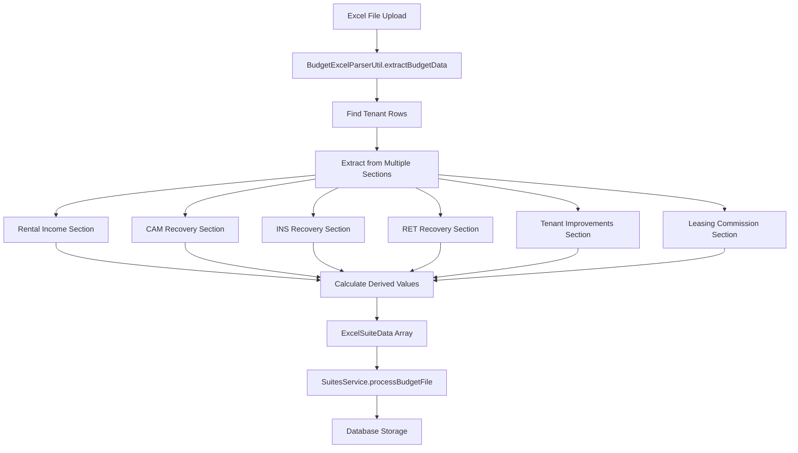

# Design Document: Excel Budget Parser

## Overview

The Excel Budget Parser extends the existing ForeSight PDF extractor module to handle Excel budget files. It integrates with the current suites API infrastructure, leveraging the existing upload endpoint and data storage patterns. The parser extracts tenant data from multiple sections of ForeSight Detail Proforma Excel files and converts it to the standardized suite data format used by the application.

## Architecture

The Excel Budget Parser follows the existing modular architecture:

```
src/modules/foresight-pdf-extractor/
├── utils/
│   └── budget-excel-parser.util.ts (existing, needs enhancement)
└── dto/
    └── excel-suite-data.dto.ts (new)

src/modules/suites/
├── suites.controller.ts (existing upload endpoint)
├── suites.service.ts (existing processing logic)
└── dto/
    └── budget-upload.dto.ts (existing response format)
```

The parser integrates with the existing `/suites/upload-budget` endpoint, which already handles both PDF and Excel file uploads through the `SuitesService.processBudgetFile()` method.

## Components and Interfaces

### Enhanced BudgetExcelParserUtil

The existing `BudgetExcelParserUtil` class will be enhanced to support the new Excel parsing requirements:

```typescript
interface ExcelSuiteData {
  propertyId: string;
  suiteId: string;
  status: 'Vacant' | 'Occupied' | 'Unknown';
  squareFootage: number;
  baseRentMonth: number;
  baseRentPerSf: number;
  camMonth: number;
  insMonth: number;
  taxMonth: number;
  totalDueMonth: number;
  tiPerSf: number;
  monthlyPayments: {
    jan: number;
    feb: number;
    mar: number;
    apr: number;
    may: number;
    jun: number;
    jul: number;
    aug: number;
    sep: number;
    oct: number;
    nov: number;
    dec: number;
  };
}

interface ExcelExtractionResult {
  success: boolean;
  suites: ExcelSuiteData[];
  extractionLogs: string[];
  errors: string[];
}
```

### Enhanced Parser Methods

The parser will include these key methods:

```typescript
class BudgetExcelParserUtil {
  // Enhanced main extraction method
  static extractBudgetData(buffer: Buffer): ExcelExtractionResult;
  
  // New tenant identification methods
  private static findTenantRows(worksheet: any): TenantRowInfo[];
  private static extractTenantIdentifiers(row: any[]): { suiteId: string; propertyId: string; status: string };
  
  // Enhanced section processing methods
  private static extractFromRentalIncomeSection(worksheet: any, tenantInfo: TenantRowInfo[]): void;
  private static extractFromCAMSection(worksheet: any, tenantInfo: TenantRowInfo[]): void;
  private static extractFromINSSection(worksheet: any, tenantInfo: TenantRowInfo[]): void;
  private static extractFromRETSection(worksheet: any, tenantInfo: TenantRowInfo[]): void;
  private static extractFromTISection(worksheet: any, tenantInfo: TenantRowInfo[]): void;
  private static extractFromLeasingCommissionSection(worksheet: any, tenantInfo: TenantRowInfo[]): void;
  
  // New calculation methods
  private static calculateBaseRentPerSf(baseRentMonth: number, squareFootage: number): number;
  private static calculateTotalDueMonth(baseRent: number, cam: number, ins: number, tax: number): number;
  private static calculateTiPerSf(tiAmount: number, squareFootage: number): number;
}
```

### Integration with Existing Services

The parser integrates seamlessly with the existing `SuitesService`:

- Uses existing `processBudgetFile()` method
- Leverages existing `convertBudgetSuiteToUpdate()` conversion logic
- Utilizes existing `updateSuitesFromBudget()` database operations
- Returns data in the existing `BudgetUploadResponseDto` format

## Data Models

### Excel Parsing Data Flow



### Section Mapping Strategy

The parser uses a multi-pass approach to extract data from different Excel sections:

1. **Discovery Pass**: Identify all tenant rows and their positions
2. **Extraction Pass**: Process each section to gather tenant-specific data
3. **Calculation Pass**: Compute derived values (baseRentPerSf, totalDueMonth, tiPerSf)
4. **Validation Pass**: Ensure data integrity and completeness

### Tenant Identification Pattern

Tenant rows are identified using these patterns:
- `"SSSS - Proposed (BRR) PPPPPP-SSSS"` for vacant suites
- `"SSSS - [Tenant Name] (BRR) PPPPPP-SSSS"` for occupied suites

Where:
- `SSSS` = Suite ID
- `PPPPPP` = Property ID
- `[Tenant Name]` = Actual tenant name or "Proposed"

## Correctness Properties

*A property is a characteristic or behavior that should hold true across all valid executions of a system-essentially, a formal statement about what the system should do. Properties serve as the bridge between human-readable specifications and machine-verifiable correctness guarantees.*

Now I need to use the prework tool to analyze the acceptance criteria before writing the correctness properties.

### Converting EARS to Properties

Based on the prework analysis and property reflection, here are the consolidated correctness properties:

**Property 1: Excel File Parsing Resilience**
*For any* Excel file input, the parser should either successfully read the workbook structure or return a descriptive error message without crashing
**Validates: Requirements 1.1, 1.2, 1.4**

**Property 2: Data Preservation During Parsing**
*For any* successfully parsed Excel file, all cell values and positions should be preserved accurately for data extraction
**Validates: Requirements 1.3**

**Property 3: Tenant Identifier Extraction**
*For any* tenant line matching the expected format patterns, the parser should correctly extract both Suite ID and Property ID regardless of whether the tenant is "Proposed" or has an actual name
**Validates: Requirements 2.1, 2.2, 2.3**

**Property 4: Invalid Format Handling**
*For any* tenant line that doesn't match expected formats, the parser should log an error and skip processing that tenant without affecting other tenants
**Validates: Requirements 2.4**

**Property 5: Financial Data Cleaning**
*For any* financial value (base rent, CAM, insurance, tax, TI amount, monthly payments), the parser should remove currency symbols and commas and return a clean numeric value
**Validates: Requirements 4.2, 4.3, 6.2, 6.3, 7.2, 7.3, 8.2, 8.3, 10.2, 11.2, 11.3**

**Property 6: Missing Data Default Values**
*For any* tenant where financial data (base rent, CAM, insurance, tax, monthly payments) is missing, the parser should return 0 for that field
**Validates: Requirements 4.4, 6.4, 7.4, 8.4, 11.4**

**Property 7: Square Footage Processing**
*For any* tenant row, the parser should extract square footage as a numeric value, cleaning non-numeric characters, or return 0 with a warning if not found
**Validates: Requirements 3.1, 3.2, 3.3, 3.4**

**Property 8: Base Rent Per Square Foot Calculation**
*For any* suite with valid base rent and square footage, baseRentPerSf should equal (baseRentMonth × 12) / squareFootage rounded to 2 decimal places, or 0 if either input is zero or missing
**Validates: Requirements 5.1, 5.2, 5.3, 5.4**

**Property 9: Total Due Month Calculation**
*For any* tenant, totalDueMonth should equal the sum of baseRentMonth + camMonth + insMonth + taxMonth, treating any missing components as 0
**Validates: Requirements 9.1, 9.2, 9.3, 9.4**

**Property 10: TI Per Square Foot Calculation**
*For any* tenant with valid TI amount and square footage, tiPerSf should equal TI Amount / squareFootage, or 0 if either input is zero or missing
**Validates: Requirements 10.3, 10.4**

**Property 11: Monthly Payments Structure**
*For any* tenant, monthly payments should be structured as an object with exactly 12 keys (jan, feb, mar, apr, may, jun, jul, aug, sep, oct, nov, dec) containing numeric values
**Validates: Requirements 11.5**

**Property 12: Tenant Status Determination**
*For any* tenant line, status should be "Vacant" if it contains "Proposed", "Occupied" if it contains an actual tenant name, or "Unknown" if status cannot be determined
**Validates: Requirements 12.1, 12.2, 12.3**

**Property 13: Multiple Tenant Processing**
*For any* Excel file with multiple tenants, each tenant should be processed separately with unique Suite IDs while maintaining the same Property ID for tenants in the same property
**Validates: Requirements 13.1, 13.2, 13.3**

**Property 14: JSON Output Structure**
*For any* extracted tenant data, the JSON output should contain all required fields (propertyId, suiteId, status, squareFootage, baseRentMonth, baseRentPerSf, camMonth, insMonth, taxMonth, totalDueMonth, tiPerSf, monthlyPayments) with correct data types
**Validates: Requirements 14.1, 14.2, 14.3, 14.4**

**Property 15: Data Validation and Error Reporting**
*For any* parsing operation, numeric validation should occur for all extracted values, and any validation errors should be logged and included in the response
**Validates: Requirements 15.1, 15.2, 15.3, 15.4**

**Property 16: End-to-End Processing**
*For any* valid Excel file upload, the parser should process it completely and either store the data successfully or return appropriate error details
**Validates: Requirements 16.2, 16.3, 16.4**

**Property 17: Resilient Error Handling**
*For any* Excel file with missing sections or corrupted data, the parser should provide specific error messages and continue processing valid portions when possible
**Validates: Requirements 17.1, 17.2, 17.3, 17.4**

## Error Handling

The Excel Budget Parser implements comprehensive error handling at multiple levels:

### File-Level Error Handling
- **Corrupted Files**: Return descriptive error messages for unreadable Excel files
- **Missing Sections**: Log specific errors for missing required sections (Rental Income, CAM Recovery, etc.)
- **Format Validation**: Validate Excel file structure before processing

### Tenant-Level Error Handling
- **Invalid Identifiers**: Skip tenants with malformed Suite/Property ID patterns
- **Missing Data**: Use default values (0) for missing financial data
- **Calculation Errors**: Handle division by zero and invalid numeric operations

### Data-Level Error Handling
- **Type Validation**: Ensure all numeric fields contain valid numbers
- **Range Validation**: Log warnings for values outside expected ranges
- **Structure Validation**: Verify required fields are present in output

### Integration Error Handling
- **API Errors**: Return appropriate HTTP status codes with error details
- **Database Errors**: Handle storage failures gracefully with rollback capability
- **Partial Processing**: Continue processing valid tenants even if some fail

## Testing Strategy

The Excel Budget Parser uses a dual testing approach combining unit tests and property-based tests for comprehensive coverage.

### Property-Based Testing
Property-based tests validate universal correctness properties across randomized inputs:

- **Library**: Use `fast-check` for TypeScript property-based testing
- **Iterations**: Minimum 100 iterations per property test
- **Coverage**: Each correctness property implemented as a separate property-based test
- **Tagging**: Each test tagged with format: **Feature: excel-budget-parser, Property {number}: {property_text}**

### Unit Testing
Unit tests focus on specific examples, edge cases, and integration points:

- **Excel File Parsing**: Test with known Excel file structures
- **Section Processing**: Verify extraction from each Excel section type
- **Calculation Logic**: Test mathematical operations with specific values
- **Error Scenarios**: Test specific error conditions and edge cases
- **API Integration**: Test upload endpoint with various file types

### Test Data Generation
- **Excel File Generation**: Create test Excel files with known data structures
- **Randomized Inputs**: Generate random tenant data for property tests
- **Edge Case Files**: Create files with missing sections, corrupted data, etc.
- **Multi-Tenant Files**: Test files with multiple tenants per property

### Integration Testing
- **End-to-End Flow**: Test complete upload → parse → store workflow
- **Database Integration**: Verify data storage and retrieval
- **API Response Validation**: Test HTTP responses and error codes
- **File Format Support**: Test various Excel formats (.xlsx, .xls)

The testing strategy ensures both correctness (property tests) and reliability (unit tests) while maintaining compatibility with the existing suites system infrastructure.