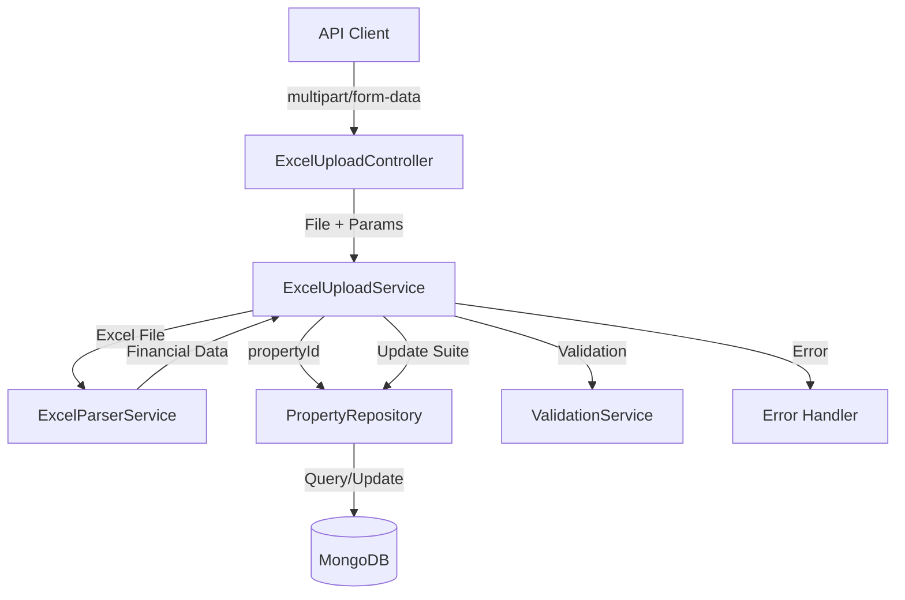
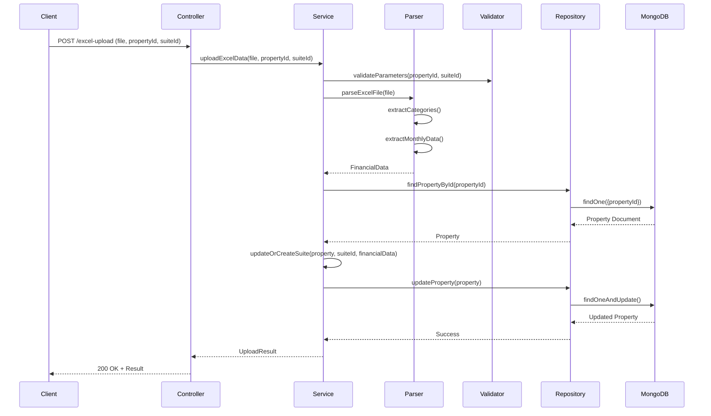

# Design Document: Excel Upload API

## Overview

The Excel Upload API is a NestJS endpoint that accepts Excel files containing property budget/proforma data from ForeSight Detail Proforma system, parses financial information organized by category and month, and updates suite-level data within MongoDB property documents. The API handles file upload, validation, parsing, and atomic database updates while providing comprehensive error handling.

The system follows a layered architecture with clear separation between HTTP handling, business logic, data parsing, and persistence. It integrates with the existing NestJS application structure and MongoDB schema while extending the Property and Suite models to support financial data storage.

## Architecture

### High-Level Architecture



### Component Interaction Flow



## Components and Interfaces

### 1. ExcelUploadController

HTTP layer responsible for handling file uploads and request/response formatting.

```typescript
@Controller('excel-upload')
@ApiTags('Excel Upload')
export class ExcelUploadController {
  constructor(private readonly excelUploadService: ExcelUploadService) {}

  @Post()
  @UseInterceptors(FileInterceptor('file'))
  @ApiConsumes('multipart/form-data')
  @ApiOperation({ summary: 'Upload Excel file with property financial data' })
  async uploadExcel(
    @UploadedFile() file: Express.Multer.File,
    @Body('propertyId') propertyId: string,
    @Body('suiteId') suiteId: string,
  ): Promise<UploadResultDto> {
    return await this.excelUploadService.uploadExcelData(file, propertyId, suiteId);
  }
}
```

**Responsibilities:**
- Accept multipart/form-data requests
- Extract file and parameters from request
- Delegate processing to service layer
- Format response as JSON
- Handle HTTP-level errors

### 2. ExcelUploadService

Business logic layer coordinating parsing, validation, and data persistence.

```typescript
@Injectable()
export class ExcelUploadService {
  constructor(
    private readonly excelParserService: ExcelParserService,
    private readonly propertyRepository: PropertyRepository,
    private readonly logger: Logger,
  ) {}

  async uploadExcelData(
    file: Express.Multer.File,
    propertyId: string,
    suiteId: string,
  ): Promise<UploadResultDto> {
    // Validate parameters
    this.validateParameters(propertyId, suiteId);
    
    // Validate file
    this.validateFile(file);
    
    // Parse Excel file
    const financialData = await this.excelParserService.parseExcelFile(file.buffer);
    
    // Find property
    const property = await this.propertyRepository.findByPropertyId(propertyId);
    if (!property) {
      throw new NotFoundException(`Property with ID ${propertyId} not found`);
    }
    
    // Update or create suite
    this.updateOrCreateSuite(property, suiteId, financialData);
    
    // Save property
    await this.propertyRepository.updateProperty(property);
    
    return {
      success: true,
      propertyId,
      suiteId,
      monthsProcessed: Object.keys(financialData.monthlyData).length,
      message: 'Excel data uploaded successfully',
    };
  }

  private validateParameters(propertyId: string, suiteId: string): void {
    if (!propertyId || propertyId.trim() === '') {
      throw new BadRequestException('propertyId is required');
    }
    if (!suiteId || suiteId.trim() === '') {
      throw new BadRequestException('suiteId is required');
    }
  }

  private validateFile(file: Express.Multer.File): void {
    if (!file) {
      throw new BadRequestException('Excel file is required');
    }
    
    const allowedExtensions = ['.xlsx', '.xls'];
    const fileExtension = file.originalname.substring(file.originalname.lastIndexOf('.'));
    
    if (!allowedExtensions.includes(fileExtension.toLowerCase())) {
      throw new BadRequestException('Only .xlsx and .xls files are supported');
    }
  }

  private updateOrCreateSuite(
    property: PropertyDocument,
    suiteId: string,
    financialData: ParsedFinancialData,
  ): void {
    let suite = property.suites?.find(s => s.suiteId === suiteId);
    
    if (!suite) {
      suite = {
        suiteId,
        tenantName: financialData.tenantName || 'Proposed Tenant',
        monthlyData: {},
        totalAnnual: {},
      };
      if (!property.suites) {
        property.suites = [];
      }
      property.suites.push(suite);
    }
    
    suite.monthlyData = financialData.monthlyData;
    suite.totalAnnual = financialData.totalAnnual;
    if (financialData.tenantName) {
      suite.tenantName = financialData.tenantName;
    }
  }
}
```

**Responsibilities:**
- Orchestrate the upload workflow
- Validate input parameters and file
- Coordinate parsing and persistence
- Handle business logic errors
- Log operations for debugging

### 3. ExcelParserService

Specialized service for parsing Excel files and extracting financial data.

```typescript
@Injectable()
export class ExcelParserService {
  private readonly logger = new Logger(ExcelParserService.name);

  async parseExcelFile(buffer: Buffer): Promise<ParsedFinancialData> {
    try {
      const workbook = XLSX.read(buffer, { type: 'buffer' });
      const worksheet = workbook.Sheets[workbook.SheetNames[0]];
      
      const jsonData = XLSX.utils.sheet_to_json(worksheet, { header: 1 });
      
      return this.extractFinancialData(jsonData);
    } catch (error) {
      this.logger.error('Failed to parse Excel file', error);
      throw new BadRequestException('Invalid Excel file format');
    }
  }

  private extractFinancialData(data: any[][]): ParsedFinancialData {
    // Find header row with month names
    const headerRow = this.findHeaderRow(data);
    const months = this.extractMonths(data[headerRow]);
    
    // Extract category data
    const categoryData = this.extractCategoryData(data, headerRow, months);
    
    // Build monthly data structure
    const monthlyData = this.buildMonthlyData(categoryData, months);
    
    // Calculate annual totals
    const totalAnnual = this.calculateAnnualTotals(categoryData);
    
    // Extract tenant name if present
    const tenantName = this.extractTenantName(data);
    
    return {
      monthlyData,
      totalAnnual,
      tenantName,
    };
  }

  private findHeaderRow(data: any[][]): number {
    for (let i = 0; i < data.length; i++) {
      const row = data[i];
      if (row.some(cell => this.isMonthHeader(cell))) {
        return i;
      }
    }
    throw new BadRequestException('Could not find month headers in Excel file');
  }

  private isMonthHeader(cell: any): boolean {
    if (typeof cell !== 'string') return false;
    const monthPattern = /^(Jan|Feb|Mar|Apr|May|Jun|Jul|Aug|Sep|Oct|Nov|Dec)-\d{2}$/;
    return monthPattern.test(cell);
  }

  private extractMonths(headerRow: any[]): string[] {
    return headerRow.filter(cell => this.isMonthHeader(cell));
  }

  private extractCategoryData(
    data: any[][],
    headerRow: number,
    months: string[],
  ): CategoryData {
    const categoryData: CategoryData = {
      rentalIncome: {},
      camRecovery: {},
      insuranceRecovery: {},
      realEstateTaxRecovery: {},
      waterIncome: {},
    };

    const categoryMappings = {
      'Total Rental Income': 'rentalIncome',
      'CAM Recovery': 'camRecovery',
      'Insurance Recovery': 'insuranceRecovery',
      'Real Estate Tax Recovery': 'realEstateTaxRecovery',
      'Other Income (Water)': 'waterIncome',
      'Water': 'waterIncome',
    };

    for (let i = headerRow + 1; i < data.length; i++) {
      const row = data[i];
      const categoryName = row[0];
      
      if (typeof categoryName === 'string') {
        const mappedCategory = categoryMappings[categoryName];
        if (mappedCategory) {
          months.forEach((month, index) => {
            const value = this.parseNumericValue(row[index + 1]);
            categoryData[mappedCategory][month] = value;
          });
          
          // Extract total if present
          const totalValue = this.parseNumericValue(row[row.length - 1]);
          categoryData[mappedCategory]['total'] = totalValue;
        }
      }
    }

    return categoryData;
  }

  private parseNumericValue(value: any): number {
    if (typeof value === 'number') return value;
    if (typeof value === 'string') {
      const cleaned = value.replace(/[,$]/g, '');
      const parsed = parseFloat(cleaned);
      return isNaN(parsed) ? 0 : parsed;
    }
    return 0;
  }

  private buildMonthlyData(
    categoryData: CategoryData,
    months: string[],
  ): Record<string, MonthlyFinancialData> {
    const monthlyData: Record<string, MonthlyFinancialData> = {};

    months.forEach(month => {
      const rentalIncome = categoryData.rentalIncome[month] || 0;
      const camRecovery = categoryData.camRecovery[month] || 0;
      const insuranceRecovery = categoryData.insuranceRecovery[month] || 0;
      const realEstateTaxRecovery = categoryData.realEstateTaxRecovery[month] || 0;
      const waterIncome = categoryData.waterIncome[month] || 0;

      monthlyData[month] = {
        rentalIncome,
        camRecovery,
        insuranceRecovery,
        realEstateTaxRecovery,
        waterIncome,
        totalIncome: rentalIncome + camRecovery + insuranceRecovery + 
                     realEstateTaxRecovery + waterIncome,
      };
    });

    return monthlyData;
  }

  private calculateAnnualTotals(categoryData: CategoryData): AnnualTotalData {
    return {
      rentalIncome: categoryData.rentalIncome['total'] || 0,
      camRecovery: categoryData.camRecovery['total'] || 0,
      insuranceRecovery: categoryData.insuranceRecovery['total'] || 0,
      realEstateTaxRecovery: categoryData.realEstateTaxRecovery['total'] || 0,
      waterIncome: categoryData.waterIncome['total'] || 0,
      totalIncome: 
        (categoryData.rentalIncome['total'] || 0) +
        (categoryData.camRecovery['total'] || 0) +
        (categoryData.insuranceRecovery['total'] || 0) +
        (categoryData.realEstateTaxRecovery['total'] || 0) +
        (categoryData.waterIncome['total'] || 0),
    };
  }

  private extractTenantName(data: any[][]): string | undefined {
    // Look for tenant name in the data
    // This is a simplified implementation - actual logic depends on Excel structure
    for (const row of data) {
      if (row[0] && typeof row[0] === 'string' && row[0].includes('Tenant')) {
        return row[1];
      }
    }
    return undefined;
  }

  // Additional method for handling account code mapping (ForeSight format)
  private mapAccountCodeToCategory(accountCode: string): string | null {
    const accountMappings = {
      '500005': 'rentalIncome',
      '534005': 'camRecovery',
      '544005': 'insuranceRecovery',
      '554005': 'realEstateTaxRecovery',
      '564010': 'waterIncome',
    };
    return accountMappings[accountCode] || null;
  }
}
```

**Responsibilities:**
- Parse Excel file buffer using xlsx library
- Extract month headers and category names
- Map ForeSight categories to internal data structure
- Handle account code mappings
- Convert string values to numbers
- Build structured financial data objects
- Handle parsing errors gracefully

### 4. PropertyRepository

Data access layer for property operations (extends existing repository).

```typescript
@Injectable()
export class PropertyRepository {
  constructor(
    @InjectModel(Property.name) private propertyModel: Model<PropertyDocument>,
  ) {}

  async findByPropertyId(propertyId: string): Promise<PropertyDocument | null> {
    return await this.propertyModel.findOne({ propertyId }).exec();
  }

  async updateProperty(property: PropertyDocument): Promise<PropertyDocument> {
    return await property.save();
  }
}
```

**Responsibilities:**
- Query properties by propertyId
- Persist property updates atomically
- Handle database errors

## Data Models

### Extended Property Schema

```typescript
@Schema({ timestamps: true, versionKey: false })
export class Property {
  @Prop({
    type: String,
    required: true,
    unique: true,
    index: true,
  })
  propertyId: string;

  @Prop({
    type: String,
    required: true,
    enum: Object.values(PropertyName),
  })
  propertyName: PropertyName;

  @Prop({
    type: String,
    required: true,
  })
  region: string;

  // NEW: Array of suites with financial data
  @Prop({
    type: [SuiteFinancialDataSchema],
    default: [],
  })
  suites: SuiteFinancialData[];
}
```

### Suite Financial Data Schema

```typescript
@Schema({ _id: false })
export class SuiteFinancialData {
  @Prop({ required: true })
  suiteId: string;

  @Prop({ required: true })
  tenantName: string;

  @Prop({ type: Map, of: MonthlyFinancialDataSchema })
  monthlyData: Map<string, MonthlyFinancialData>;

  @Prop({ type: AnnualTotalDataSchema })
  totalAnnual: AnnualTotalData;
}

export const SuiteFinancialDataSchema = SchemaFactory.createForClass(SuiteFinancialData);
```

### Monthly Financial Data Schema

```typescript
@Schema({ _id: false })
export class MonthlyFinancialData {
  @Prop({ required: true, type: Number })
  rentalIncome: number;

  @Prop({ required: true, type: Number })
  camRecovery: number;

  @Prop({ required: true, type: Number })
  insuranceRecovery: number;

  @Prop({ required: true, type: Number })
  realEstateTaxRecovery: number;

  @Prop({ required: true, type: Number })
  waterIncome: number;

  @Prop({ required: true, type: Number })
  totalIncome: number;
}

export const MonthlyFinancialDataSchema = SchemaFactory.createForClass(MonthlyFinancialData);
```

### Annual Total Data Schema

```typescript
@Schema({ _id: false })
export class AnnualTotalData {
  @Prop({ required: true, type: Number })
  rentalIncome: number;

  @Prop({ required: true, type: Number })
  camRecovery: number;

  @Prop({ required: true, type: Number })
  insuranceRecovery: number;

  @Prop({ required: true, type: Number })
  realEstateTaxRecovery: number;

  @Prop({ required: true, type: Number })
  waterIncome: number;

  @Prop({ required: true, type: Number })
  totalIncome: number;
}

export const AnnualTotalDataSchema = SchemaFactory.createForClass(AnnualTotalData);
```

### DTOs

```typescript
// Upload Result DTO
export class UploadResultDto {
  @ApiProperty()
  success: boolean;

  @ApiProperty()
  propertyId: string;

  @ApiProperty()
  suiteId: string;

  @ApiProperty()
  monthsProcessed: number;

  @ApiProperty()
  message: string;
}

// Parsed Financial Data (internal)
export interface ParsedFinancialData {
  monthlyData: Record<string, MonthlyFinancialData>;
  totalAnnual: AnnualTotalData;
  tenantName?: string;
}

// Category Data (internal parsing structure)
export interface CategoryData {
  rentalIncome: Record<string, number>;
  camRecovery: Record<string, number>;
  insuranceRecovery: Record<string, number>;
  realEstateTaxRecovery: Record<string, number>;
  waterIncome: Record<string, number>;
}
```

## Correctness Properties

*A property is a characteristic or behavior that should hold true across all valid executions of a system—essentially, a formal statement about what the system should do. Properties serve as the bridge between human-readable specifications and machine-verifiable correctness guarantees.*


### Property Reflection

After analyzing all acceptance criteria, several properties can be consolidated:

**Consolidations:**
- Requirements 6.2-6.6 (individual field inclusion) can be combined into a single property that validates all required fields are present in monthly data
- Requirements 7.2-7.6 (individual annual total fields) can be combined into a single property that validates all required fields are present in annual totals
- Requirements 3.4-3.8 (specific category recognition) are specific examples that can be tested together
- Requirements 11.4-11.8 (account code mappings) are specific examples that can be tested together
- Requirements 2.5 and 2.6 (parameter validation) can be combined into a single property about non-empty string validation

**Properties to Keep:**
- File upload acceptance and validation (1.1, 1.4, 1.5)
- Parsing logic (3.1, 3.2, 3.3, 3.9, 3.10, 3.11, 3.12)
- Property validation (4.1, 4.2, 4.3, 4.4)
- Suite update/create logic (5.1, 5.2, 5.3, 5.4, 5.5, 5.6, 5.7)
- Monthly data processing (6.1, 6.7, 6.8)
- Annual totals calculation (7.1, 7.7)
- Error handling (8.1, 8.2, 8.7, 8.8)
- Success response (9.2, 9.3, 9.4, 9.5)
- Data integrity (10.1, 10.2, 10.3, 10.4, 10.5)
- ForeSight format handling (11.2, 11.3, 11.9, 11.10)

### Correctness Properties

Property 1: File upload acceptance
*For any* valid Excel file (.xlsx or .xls) sent via multipart/form-data, the API should accept the file without error
**Validates: Requirements 1.1, 1.2, 1.3**

Property 2: Invalid file rejection
*For any* file with an unsupported extension or invalid Excel format, the API should reject the request and return an error response
**Validates: Requirements 1.4, 1.5**

Property 3: Parameter validation
*For any* request with missing or empty propertyId or suiteId parameters, the API should return a 400 error response indicating the missing or invalid parameter
**Validates: Requirements 2.3, 2.4, 2.5, 2.6**

Property 4: Category extraction
*For any* valid Excel file with category names in the first column, the parser should extract all recognized category names correctly
**Validates: Requirements 3.1**

Property 5: Month header extraction
*For any* valid Excel file with month headers in the format "MMM-YY", the parser should extract all month identifiers from the first row
**Validates: Requirements 3.2**

Property 6: Numerical value extraction
*For any* valid Excel file with numerical values in category-month cells, the parser should extract all values correctly, converting formatted strings (with commas, dollar signs) to numbers
**Validates: Requirements 3.3, 3.10**

Property 7: Empty cell handling
*For any* Excel file with empty or invalid cell values, the parser should treat them as zero without throwing errors
**Validates: Requirements 3.11**

Property 8: Annual total extraction
*For any* valid Excel file with a "Total" column, the parser should extract annual total values for each category
**Validates: Requirements 3.9**

Property 9: Parsing error handling
*For any* Excel file that does not match the expected structure, the parser should return a descriptive error indicating parsing failure
**Validates: Requirements 3.12**

Property 10: Property existence validation
*For any* propertyId, the API should query the database and return a 404 error with the propertyId if the property does not exist
**Validates: Requirements 4.1, 4.3, 4.4**

Property 11: Suite update behavior
*For any* property with an existing suite matching the suiteId, the API should update that suite's financial data while preserving other suite fields not included in the Excel file
**Validates: Requirements 5.1, 5.3**

Property 12: Suite creation behavior
*For any* property without a suite matching the suiteId, the API should create a new suite entry in the property's suites array
**Validates: Requirements 5.2**

Property 13: Monthly data structure
*For any* parsed Excel file, the API should store monthly financial data in a monthlyData object with all required fields (rentalIncome, camRecovery, insuranceRecovery, realEstateTaxRecovery, waterIncome, totalIncome)
**Validates: Requirements 5.4, 6.1, 6.2, 6.3, 6.4, 6.5, 6.6**

Property 14: Monthly total calculation
*For any* month's financial data, the totalIncome should equal the sum of rentalIncome, camRecovery, insuranceRecovery, realEstateTaxRecovery, and waterIncome
**Validates: Requirements 6.7**

Property 15: Numerical value storage
*For any* financial data stored in the database, all values should be stored as numbers without currency symbols or formatting characters
**Validates: Requirements 6.8, 10.4**

Property 16: Annual totals structure
*For any* parsed Excel file, the API should store annual total data in a totalAnnual object with all required fields (rentalIncome, camRecovery, insuranceRecovery, realEstateTaxRecovery, waterIncome, totalIncome)
**Validates: Requirements 7.1, 7.2, 7.3, 7.4, 7.5, 7.6**

Property 17: Annual total calculation
*For any* suite's annual totals, the totalIncome should equal the sum of all category annual totals
**Validates: Requirements 7.7**

Property 18: Tenant name extraction and storage
*For any* Excel file containing a tenant name, the API should extract and store it in the suite's tenantName field
**Validates: Requirements 5.6**

Property 19: Database persistence
*For any* successful upload operation, the updated property document should be persisted to the database and retrievable in subsequent queries
**Validates: Requirements 5.7**

Property 20: Error response format
*For any* error condition (file upload, parsing, validation, database), the API should return an appropriate HTTP error status code with an error message in the response body
**Validates: Requirements 8.1, 8.2, 8.7**

Property 21: Error logging
*For any* error that occurs during processing, the API should log the error with sufficient detail for debugging
**Validates: Requirements 8.8**

Property 22: Success response structure
*For any* successful upload operation, the API should return a 200 status code with a JSON response containing propertyId, suiteId, monthsProcessed count, and a success message
**Validates: Requirements 9.1, 9.2, 9.3, 9.4, 9.5, 9.6**

Property 23: Atomic updates
*For any* suite update operation, if a database error occurs, the property document should remain unchanged (no partial updates)
**Validates: Requirements 10.1, 10.2**

Property 24: Data validation before persistence
*For any* suite data being persisted, all required fields must be present and valid before the database operation is executed
**Validates: Requirements 10.3**

Property 25: Suite isolation
*For any* property with multiple suites, updating one suite should not modify any other suite's data
**Validates: Requirements 10.5**

Property 26: ForeSight summary format parsing
*For any* ForeSight Excel file in summary view format (category rows, month columns), the parser should correctly extract all financial data
**Validates: Requirements 11.1, 11.2**

Property 27: ForeSight detailed format parsing
*For any* ForeSight Excel file with detailed line-item data containing suite identifiers and account codes, the parser should correctly map account codes to categories and extract suite identifiers
**Validates: Requirements 11.3, 11.9**

Property 28: Tenant name extraction from detailed view
*For any* ForeSight Excel file with tenant names in the detailed view, the parser should extract and associate tenant names with the correct suite data
**Validates: Requirements 11.10**

## Error Handling

### Error Categories and Responses

1. **File Upload Errors**
   - Missing file: 400 Bad Request - "Excel file is required"
   - Invalid extension: 400 Bad Request - "Only .xlsx and .xls files are supported"
   - Corrupted file: 400 Bad Request - "Invalid Excel file format"

2. **Parameter Validation Errors**
   - Missing propertyId: 400 Bad Request - "propertyId is required"
   - Missing suiteId: 400 Bad Request - "suiteId is required"
   - Empty propertyId: 400 Bad Request - "propertyId cannot be empty"
   - Empty suiteId: 400 Bad Request - "suiteId cannot be empty"

3. **Parsing Errors**
   - Invalid structure: 400 Bad Request - "Could not find month headers in Excel file"
   - Missing categories: 400 Bad Request - "Excel file does not contain expected financial categories"
   - Malformed data: 400 Bad Request - "Invalid Excel file format"

4. **Database Errors**
   - Property not found: 404 Not Found - "Property with ID {propertyId} not found"
   - Database connection failure: 500 Internal Server Error - "Database operation failed"
   - Update failure: 500 Internal Server Error - "Failed to update property data"

5. **Validation Errors**
   - Invalid data types: 400 Bad Request - "Financial data contains invalid values"
   - Missing required fields: 400 Bad Request - "Required financial data fields are missing"

### Error Handling Strategy

```typescript
// Global exception filter for consistent error responses
@Catch()
export class AllExceptionsFilter implements ExceptionFilter {
  catch(exception: unknown, host: ArgumentsHost) {
    const ctx = host.switchToHttp();
    const response = ctx.getResponse();
    const request = ctx.getRequest();

    let status = HttpStatus.INTERNAL_SERVER_ERROR;
    let message = 'Internal server error';

    if (exception instanceof HttpException) {
      status = exception.getStatus();
      message = exception.message;
    } else if (exception instanceof Error) {
      message = exception.message;
    }

    this.logger.error(
      `Error processing request: ${request.method} ${request.url}`,
      exception,
    );

    response.status(status).json({
      statusCode: status,
      message,
      timestamp: new Date().toISOString(),
      path: request.url,
    });
  }
}
```

### Logging Strategy

- Log all incoming requests with file size and parameters
- Log parsing start and completion with timing
- Log database queries and updates
- Log all errors with full stack traces
- Log success operations with summary statistics

## Testing Strategy

### Dual Testing Approach

The testing strategy employs both unit tests and property-based tests to ensure comprehensive coverage:

- **Unit tests**: Verify specific examples, edge cases, and error conditions
- **Property tests**: Verify universal properties across all inputs
- Both approaches are complementary and necessary for complete validation

### Unit Testing

Unit tests focus on:
- Specific examples of category recognition (e.g., "Total Rental Income" → rentalIncome)
- Specific account code mappings (e.g., 500005 → rentalIncome)
- Specific error status codes (404 for not found, 400 for bad request, 500 for server error)
- Integration between controller, service, parser, and repository
- Edge cases like empty Excel files, single-month files, missing tenant names
- Error conditions like database connection failures, invalid file formats

Example unit tests:
```typescript
describe('ExcelUploadService', () => {
  it('should reject files with unsupported extensions', async () => {
    const file = createMockFile('test.pdf');
    await expect(service.uploadExcelData(file, 'prop1', 'suite1'))
      .rejects.toThrow('Only .xlsx and .xls files are supported');
  });

  it('should return 404 when property does not exist', async () => {
    mockRepository.findByPropertyId.mockResolvedValue(null);
    await expect(service.uploadExcelData(validFile, 'nonexistent', 'suite1'))
      .rejects.toThrow(NotFoundException);
  });

  it('should map account code 500005 to rental income', () => {
    const category = parser.mapAccountCodeToCategory('500005');
    expect(category).toBe('rentalIncome');
  });
});
```

### Property-Based Testing

Property-based tests use **fast-check** library (already in package.json) to verify universal properties across randomly generated inputs.

Configuration:
- Minimum 100 iterations per property test
- Each test tagged with feature name and property number
- Tag format: `Feature: excel-upload-api, Property {N}: {property text}`

Example property tests:
```typescript
import * as fc from 'fast-check';

describe('ExcelUploadService - Property Tests', () => {
  // Feature: excel-upload-api, Property 14: Monthly total calculation
  it('should calculate monthly totalIncome as sum of all categories', () => {
    fc.assert(
      fc.property(
        fc.record({
          rentalIncome: fc.float({ min: 0, max: 1000000 }),
          camRecovery: fc.float({ min: 0, max: 100000 }),
          insuranceRecovery: fc.float({ min: 0, max: 50000 }),
          realEstateTaxRecovery: fc.float({ min: 0, max: 50000 }),
          waterIncome: fc.float({ min: 0, max: 10000 }),
        }),
        (monthlyData) => {
          const calculated = service.calculateMonthlyTotal(monthlyData);
          const expected = 
            monthlyData.rentalIncome +
            monthlyData.camRecovery +
            monthlyData.insuranceRecovery +
            monthlyData.realEstateTaxRecovery +
            monthlyData.waterIncome;
          expect(calculated).toBeCloseTo(expected, 2);
        }
      ),
      { numRuns: 100 }
    );
  });

  // Feature: excel-upload-api, Property 2: Invalid file rejection
  it('should reject any file with unsupported extension', () => {
    fc.assert(
      fc.property(
        fc.string().filter(ext => !ext.endsWith('.xlsx') && !ext.endsWith('.xls')),
        (filename) => {
          const file = createMockFile(filename);
          expect(() => service.validateFile(file)).toThrow();
        }
      ),
      { numRuns: 100 }
    );
  });

  // Feature: excel-upload-api, Property 25: Suite isolation
  it('should only update the specified suite without affecting others', () => {
    fc.assert(
      fc.property(
        fc.array(fc.record({
          suiteId: fc.string(),
          tenantName: fc.string(),
          monthlyData: fc.dictionary(fc.string(), fc.float()),
        }), { minLength: 2, maxLength: 10 }),
        fc.nat(),
        fc.record({
          monthlyData: fc.dictionary(fc.string(), fc.float()),
          totalAnnual: fc.record({
            rentalIncome: fc.float(),
            totalIncome: fc.float(),
          }),
        }),
        (suites, targetIndex, newData) => {
          targetIndex = targetIndex % suites.length;
          const property = { suites: [...suites] };
          const targetSuiteId = suites[targetIndex].suiteId;
          
          service.updateOrCreateSuite(property, targetSuiteId, newData);
          
          // Verify only target suite was modified
          suites.forEach((originalSuite, index) => {
            if (index !== targetIndex) {
              expect(property.suites[index]).toEqual(originalSuite);
            }
          });
        }
      ),
      { numRuns: 100 }
    );
  });
});
```

### Test Coverage Goals

- Unit test coverage: >80% of lines
- Property test coverage: All 28 correctness properties
- Integration test coverage: End-to-end API flows
- Error path coverage: All error conditions tested

### Testing Dependencies

Required packages (already available):
- `jest`: Test runner
- `fast-check`: Property-based testing library
- `@nestjs/testing`: NestJS testing utilities
- `supertest`: HTTP integration testing

Additional package needed:
- `xlsx`: Excel file parsing library (needs to be installed)

## Implementation Notes

### Dependencies to Install

```bash
npm install xlsx
npm install --save-dev @types/multer
```

### Module Structure

```
src/modules/excel-upload/
├── excel-upload.module.ts
├── excel-upload.controller.ts
├── excel-upload.service.ts
├── excel-parser.service.ts
├── dto/
│   └── upload-result.dto.ts
├── interfaces/
│   ├── parsed-financial-data.interface.ts
│   ├── category-data.interface.ts
│   └── monthly-financial-data.interface.ts
└── __tests__/
    ├── excel-upload.service.spec.ts
    ├── excel-upload.service.property.spec.ts
    ├── excel-parser.service.spec.ts
    └── excel-parser.service.property.spec.ts
```

### Schema Updates

The Property schema needs to be extended to include the suites array. This should be done carefully to avoid breaking existing functionality:

1. Add the suites field as optional with default empty array
2. Create migration script if needed for existing properties
3. Update PropertyRepository to handle suite operations
4. Ensure backward compatibility with existing property queries

### Performance Considerations

- Excel files should be limited to reasonable size (e.g., 10MB max)
- Parsing should be done asynchronously to avoid blocking
- Database updates should use atomic operations
- Consider adding request timeout for large files
- Add file size validation in controller

### Security Considerations

- Validate file MIME type in addition to extension
- Sanitize file content before parsing
- Limit file upload size
- Validate all extracted data before database operations
- Use parameterized queries to prevent injection
- Add rate limiting for upload endpoint
- Implement authentication/authorization for the endpoint

### Future Enhancements

- Support for batch uploads (multiple suites in one file)
- Support for multiple properties in one file
- Excel template download endpoint
- Data validation against business rules
- Audit trail for uploads
- Rollback capability for failed uploads
- Support for additional financial categories
- Export functionality (download suite data as Excel)
