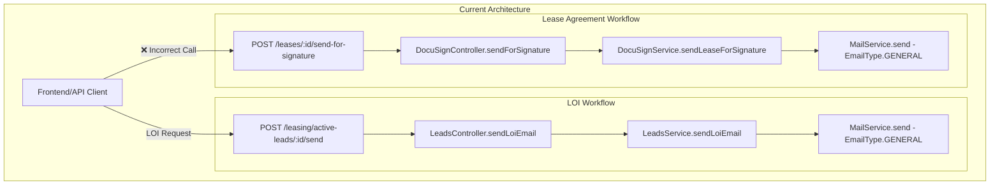
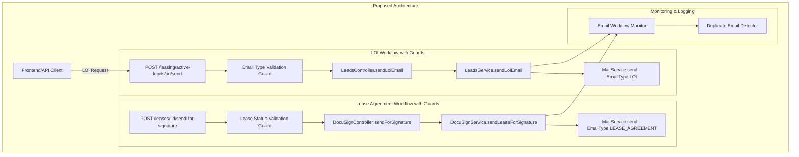

# Design Document

## Overview

The duplicate LOI email issue stems from two separate email workflows that may be incorrectly triggered simultaneously:

1. **LOI Email Workflow**: `POST /leasing/active-leads/:id/send` → `LeadsService.sendLoiEmail()`
2. **Lease Agreement Email Workflow**: `POST /leases/:id/send-for-signature` → `DocuSignController.sendForSignature()`

The investigation reveals that both workflows are independent and use different endpoints, DTOs, and services. The issue likely occurs when:
- Frontend code incorrectly calls both endpoints
- Some automation or event handler triggers both workflows
- Shared data or parameters cause confusion between LOI and lease agreement processes

The solution involves implementing proper workflow isolation, adding validation guards, and enhancing logging to prevent and detect duplicate email scenarios.

## Architecture





## Components and Interfaces

### Email Workflow Isolation Service

```typescript
interface EmailWorkflowContext {
  workflowType: 'LOI' | 'LEASE_AGREEMENT' | 'APPROVAL' | 'RENEWAL';
  leadId: string;
  userId: string;
  timestamp: Date;
  requestId: string;
}

interface EmailWorkflowGuard {
  validateWorkflow(context: EmailWorkflowContext): Promise<boolean>;
  preventDuplicates(context: EmailWorkflowContext): Promise<void>;
}

class EmailWorkflowIsolationService implements EmailWorkflowGuard {
  async validateWorkflow(context: EmailWorkflowContext): Promise<boolean>;
  async preventDuplicates(context: EmailWorkflowContext): Promise<void>;
  async logWorkflowExecution(context: EmailWorkflowContext): Promise<void>;
}
```

### Enhanced Email Types

```typescript
enum EmailType {
  PASSWORD_RESET = 'PASSWORD_RESET',
  SETUP_ACCOUNT = 'SETUP_ACCOUNT',
  LOGIN_OTP = 'LOGIN_OTP',
  GENERAL = 'GENERAL',
  LOI = 'LOI',                    // New: Specific for LOI emails
  LEASE_AGREEMENT = 'LEASE_AGREEMENT', // New: Specific for lease agreement emails
  COURTESY = 'COURTESY',
  THREE_DAY = 'THREE_DAY',
  ATTORNEY = 'ATTORNEY',
}
```

### Duplicate Detection Service

```typescript
interface EmailSendRecord {
  leadId: string;
  emailType: EmailType;
  recipient: string;
  subject: string;
  timestamp: Date;
  workflowType: string;
  requestId: string;
}

class DuplicateEmailDetectionService {
  async recordEmailSend(record: EmailSendRecord): Promise<void>;
  async checkForDuplicates(record: EmailSendRecord): Promise<boolean>;
  async getDuplicateWindow(): Promise<number>; // Time window in minutes
}
```

## Data Models

### Email Workflow Context Model

```typescript
interface EmailWorkflowExecution {
  id: string;
  leadId: string;
  workflowType: 'LOI' | 'LEASE_AGREEMENT' | 'APPROVAL' | 'RENEWAL';
  emailType: EmailType;
  recipient: string;
  subject: string;
  status: 'INITIATED' | 'SENT' | 'FAILED' | 'BLOCKED_DUPLICATE';
  timestamp: Date;
  userId: string;
  requestId: string;
  metadata?: {
    attachmentCount?: number;
    ccRecipients?: string[];
    followUpDays?: number;
  };
}
```

### Lead Email History Model

```typescript
interface LeadEmailHistory {
  leadId: string;
  emailExecutions: EmailWorkflowExecution[];
  lastLoiSent?: Date;
  lastLeaseAgreementSent?: Date;
  duplicateDetectionEnabled: boolean;
}
```

## Correctness Properties

*A property is a characteristic or behavior that should hold true across all valid executions of a system-essentially, a formal statement about what the system should do. Properties serve as the bridge between human-readable specifications and machine-verifiable correctness guarantees.*

Let me analyze the acceptance criteria to determine which ones are testable as properties:

### Property 1: Email Workflow Isolation
*For any* email workflow request (LOI, lease agreement, approval, renewal), executing that workflow should only send emails of the corresponding type and should not trigger any other email workflows.
**Validates: Requirements 2.1, 2.2, 3.2, 3.3**

### Property 2: LOI Email Correctness
*For any* valid LOI email request, the system should send exactly one email with subject format "LOI for [Suite] at [Property]", contain the correct attachments, and be sent through the LOI workflow only.
**Validates: Requirements 3.1, 4.3**

### Property 3: Lease Agreement Email Correctness
*For any* valid lease agreement request, the system should send exactly one lease agreement email and it should only be sent through the DocuSign workflow.
**Validates: Requirements 4.1, 4.4**

### Property 4: Regression Prevention
*For any* existing email workflow (LOI, lease agreement, approval, renewal, tenant magic link), the workflow should continue to function correctly after the duplicate email fix is implemented.
**Validates: Requirements 3.4, 3.5, 4.1, 4.2, 4.5**

### Property 5: Comprehensive Email Logging
*For any* email sent by the system, the logs should contain the email type, recipient, workflow that triggered it, and if the email sending fails, detailed error information including workflow context.
**Validates: Requirements 5.1, 5.2, 5.4, 5.5**

### Property 6: Duplicate Detection Logging
*For any* scenario where multiple email workflows are triggered simultaneously for the same lead, the system should log warnings about potential duplicate sends.
**Validates: Requirements 5.3**

## Error Handling

### Workflow Validation Errors

```typescript
class EmailWorkflowValidationError extends Error {
  constructor(
    public workflowType: string,
    public leadId: string,
    public reason: string
  ) {
    super(`Email workflow validation failed: ${reason}`);
  }
}
```

### Duplicate Detection Errors

```typescript
class DuplicateEmailDetectedError extends Error {
  constructor(
    public leadId: string,
    public emailType: EmailType,
    public previousSendTime: Date
  ) {
    super(`Duplicate email detected for lead ${leadId}`);
  }
}
```

### Error Handling Strategy

1. **Validation Failures**: Log error and return 400 Bad Request with specific validation message
2. **Duplicate Detection**: Log warning, block duplicate email, return success with duplicate prevention message
3. **Service Failures**: Log error with full context, return 500 Internal Server Error
4. **Partial Failures**: If logging fails but email succeeds, log the logging failure but don't fail the request

## Testing Strategy

### Dual Testing Approach

The testing strategy combines unit tests for specific scenarios and property-based tests for comprehensive coverage:

**Unit Tests Focus:**
- Specific duplicate email scenarios with known inputs
- Error handling edge cases (network failures, invalid data)
- Integration points between email workflows and validation services
- Logging verification for specific workflow executions

**Property-Based Tests Focus:**
- Universal properties across all email workflows (minimum 100 iterations each)
- Workflow isolation across randomly generated email requests
- Email correctness properties across various lead and property data
- Logging completeness across different failure scenarios

**Property Test Configuration:**
- Use fast-check library for TypeScript property-based testing
- Minimum 100 iterations per property test
- Each property test references its design document property
- Tag format: **Feature: fix-duplicate-loi-emails, Property {number}: {property_text}**

**Test Data Generation:**
- Generate random lead data with various property and suite configurations
- Generate random email requests with different attachment combinations
- Generate failure scenarios (network timeouts, invalid email addresses)
- Generate concurrent workflow execution scenarios

### Integration Testing

**Email Workflow Integration Tests:**
- Test complete LOI email workflow from controller to email delivery
- Test complete lease agreement workflow from controller to email delivery
- Test workflow isolation by triggering multiple workflows simultaneously
- Test duplicate detection across different time windows

**Monitoring and Logging Integration Tests:**
- Verify log entries are created for all email workflows
- Test log aggregation and duplicate detection alerts
- Verify error logs contain sufficient debugging information