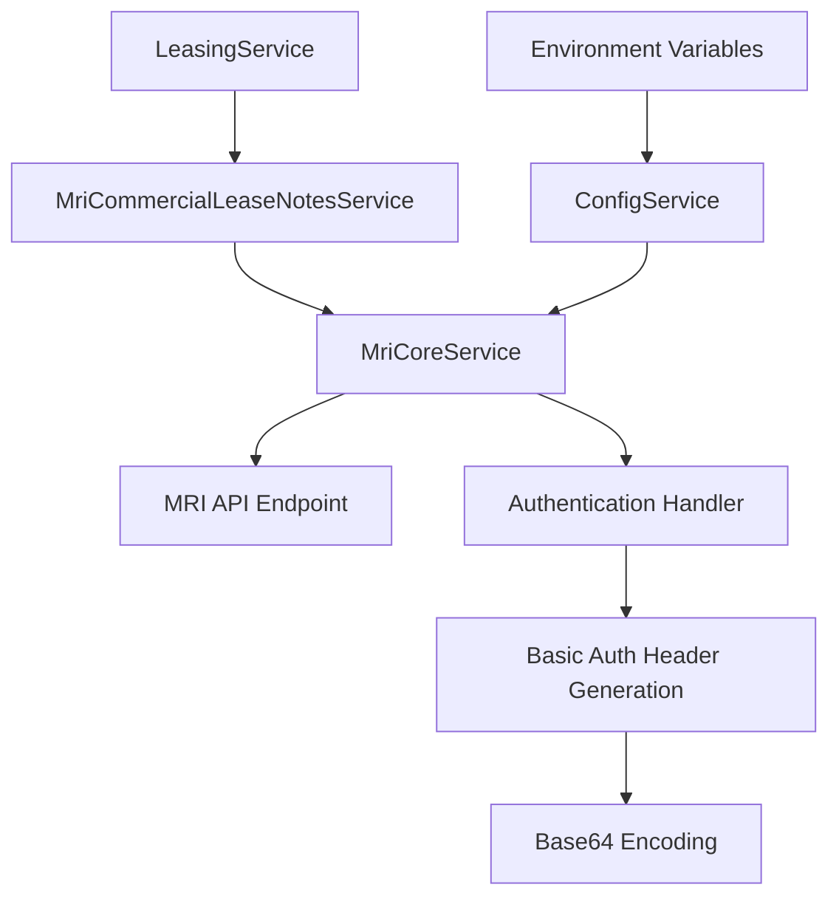

# Design Document: Fix MRI Commercial Lease Notes Authentication

## Overview

This design addresses the 401 Unauthorized error occurring with the `MRI_S-PMCM_CommercialLeasesNoteByBuildingID` API call. The issue prevents the leasing service from creating renewal notes for commercial leases. The solution involves systematic diagnosis of authentication differences between working and failing MRI APIs, followed by targeted fixes to ensure consistent authentication handling.

## Architecture

The MRI API authentication system follows a layered architecture:



**Key Components:**
- **LeasingService**: Initiates commercial lease note creation
- **MriCommercialLeaseNotesService**: Handles commercial lease note operations
- **MriCoreService**: Manages authentication and HTTP requests to MRI APIs
- **Authentication Handler**: Generates Basic Auth headers from configuration

## Components and Interfaces

### MriCoreService Authentication Interface

```typescript
interface AuthenticationConfig {
  clientId: string;
  databaseName: string;
  userId: string;
  developerKey: string;
  password: string;
}

interface MriApiRequest {
  apiName: string;
  method: 'GET' | 'PUT' | 'POST';
  params: Record<string, any>;
  body?: any;
}
```

### Commercial Lease Notes Service Interface

```typescript
interface CreateCommercialLeaseNoteDto {
  BuildingID: string;
  LeaseID: string;
  NoteDate: string;
  NoteText?: string;
  NoteReference1: string;
  NoteReference2: string;
}

interface MriCommercialLeaseNote {
  BuildingID: string;
  LeaseID: string;
  NoteDate: string;
  NoteText: string;
  NoteReference1: string;
  NoteReference2: string;
  LastUpdate: string;
  UserID: string;
}
```

## Data Models

### Authentication Data Flow

```typescript
// Environment Configuration
const authConfig = {
  clientId: process.env.MRI_CLIENT_ID,
  databaseName: process.env.MRI_DATABASE_NAME,
  userId: process.env.MRI_USER_ID,
  developerKey: process.env.MRI_DEVELOPER_KEY,
  password: process.env.MRI_PASSWORD
};

// Basic Auth String Format
const authString = `${clientId}/${databaseName}/${userId}/${developerKey}:${password}`;
const authHeader = `Basic ${Buffer.from(authString).toString('base64')}`;
```

### Request Structure Comparison

**Working API (MRI_S-PMCM_LeaseNotes):**
```typescript
// PUT request structure
{
  url: baseUrl,
  params: {
    $api: 'MRI_S-PMCM_LeaseNotes',
    $format: 'json',
    BUILDINGID: buildingId,
    LEASEID: leaseId,
    // ... other params
  },
  body: {
    entry: { /* note data */ }
  }
}
```

**Failing API (MRI_S-PMCM_CommercialLeasesNoteByBuildingID):**
```typescript
// PUT request structure
{
  url: baseUrl,
  params: {
    $api: 'MRI_S-PMCM_CommercialLeasesNoteByBuildingID',
    $format: 'json'
  },
  body: {
    'mri_s-pmcm_commercialleasesnotebybuildingid': {
      entry: { /* note data */ }
    }
  }
}
```

## Correctness Properties

*A property is a characteristic or behavior that should hold true across all valid executions of a system-essentially, a formal statement about what the system should do. Properties serve as the bridge between human-readable specifications and machine-verifiable correctness guarantees.*

### Property 1: Authentication Consistency Across APIs
*For any* MRI API endpoint (working or failing), the authentication header format, credential loading, and Basic Auth encoding should be identical to ensure consistent authentication behavior.
**Validates: Requirements 1.2, 2.2, 3.3, 5.1, 5.3**

### Property 2: Authentication Success with Valid Credentials  
*For any* valid set of MRI credentials, the Commercial_Lease_Notes_API should accept the authentication and process requests successfully.
**Validates: Requirements 1.1**

### Property 3: Request Format Compliance
*For any* Commercial_Lease_Notes_API request, the API name, query parameters, JSON structure, and nested entry format should match MRI documentation requirements exactly.
**Validates: Requirements 1.4, 2.1, 2.3, 3.1, 3.2, 3.4**

### Property 4: Comprehensive Error Logging
*For any* failed API call, the system should log complete request details (headers, URL, parameters), response details, and provide actionable error messages highlighting specific issues.
**Validates: Requirements 4.1, 4.2, 4.3, 4.4**

### Property 5: Parameter Validation Compliance
*For any* Commercial_Lease_Notes_API request, all query parameters should match MRI documentation requirements and follow consistent naming conventions.
**Validates: Requirements 2.4**

### Property 6: Configuration and Behavior Consistency
*For any* MRI API call, the system should use identical environment variables, retry logic, and error handling patterns to ensure consistent behavior.
**Validates: Requirements 5.2, 5.4**

## Error Handling

### Authentication Error Recovery
- **401 Unauthorized**: Log complete authentication details, verify credential format, compare with working APIs
- **Credential Validation**: Verify all required environment variables are present and correctly formatted
- **Retry Logic**: Apply consistent 3-attempt retry with exponential backoff for transient failures

### Request Format Error Recovery
- **API Name Validation**: Verify exact case-sensitive API name matches documentation
- **Parameter Validation**: Ensure required query parameters ($api, $format) are present
- **Body Structure Validation**: Verify JSON nesting matches expected format

### Diagnostic Logging Strategy
```typescript
// Enhanced logging for authentication debugging
this.logger.debug(`Auth Header: ${authHeader}`);
this.logger.debug(`Request URL: ${url}`);
this.logger.debug(`Query Params: ${JSON.stringify(queryParams)}`);
this.logger.debug(`Request Body: ${JSON.stringify(body)}`);

// Comparison logging with working APIs
this.logger.debug(`Working API Auth: ${workingApiAuthHeader}`);
this.logger.debug(`Failing API Auth: ${failingApiAuthHeader}`);
this.logger.debug(`Auth Headers Match: ${authHeadersMatch}`);
```

## Testing Strategy

### Dual Testing Approach
The testing strategy combines suite tests for specific scenarios with property-based tests for comprehensive coverage:

**suite Tests:**
- Test specific authentication failure scenarios (missing credentials, invalid format)
- Test exact API name and parameter formatting
- Test error logging output for known failure cases
- Test integration between LeasingService and MriCommercialLeaseNotesService

**Property-Based Tests:**
- Verify authentication consistency across all MRI APIs (minimum 100 iterations)
- Test request format compliance with generated credential combinations
- Validate error logging completeness across various failure scenarios
- Test configuration consistency with randomized environment variable combinations

**Property Test Configuration:**
- Use a property-based testing library appropriate for TypeScript/Node.js (e.g., fast-check)
- Configure each test to run minimum 100 iterations for thorough coverage
- Tag each test with format: **Feature: fix-mri-commercial-lease-notes-auth, Property {number}: {property_text}**

**Test Implementation Requirements:**
- Each correctness property must be implemented by a single property-based test
- suite tests focus on concrete examples and edge cases
- Property tests verify universal behaviors across input ranges
- Both test types are complementary and required for comprehensive coverage
