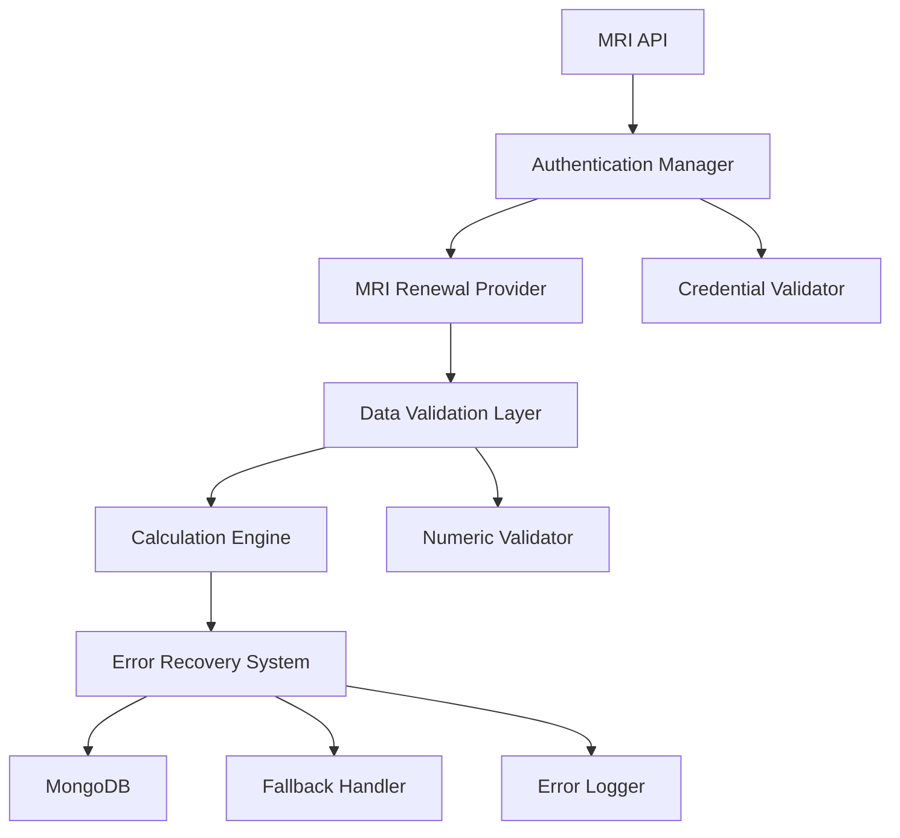

# Design Document

## Overview

This design addresses two critical issues in the renewals system: (1) `rentPerSf` calculations resulting in `NaN` values that cause MongoDB cast errors, and (2) MRI API authentication failures due to missing or incorrect credentials. The root cause analysis reveals that the `rentPerSf` calculation in `MriRenewalProvider.transformToRenewalData()` can produce `NaN` when `currentMonthRent` contains invalid numeric values, and the MRI authentication system requires all five credentials (CLIENT_ID, DATABASE, USER, PASSWORD, API_KEY) to be properly configured.

## Architecture

The solution involves three main architectural components:

1. **Data Validation Layer**: Intercepts and validates all numeric calculations before database operations
2. **Authentication Manager**: Ensures proper MRI API credential validation and error handling  
3. **Error Recovery System**: Provides fallback mechanisms and comprehensive logging for both calculation and authentication failures



## Components and Interfaces

### Authentication Manager

**Purpose**: Manages MRI API authentication and credential validation

**Interface**:
```typescript
interface AuthenticationManager {
  validateCredentials(): Promise<CredentialValidationResult>;
  getAuthHeader(): string;
  handleAuthError(error: AuthError): void;
}

interface CredentialValidationResult {
  isValid: boolean;
  missingCredentials: string[];
  errorMessage?: string;
}
```

**Key Methods**:
- `validateCredentials()`: Checks all required MRI credentials are present and valid
- `getAuthHeader()`: Generates proper Basic Auth header with all credentials
- `handleAuthError()`: Processes 401 errors and provides actionable error messages

### Data Validation Layer

**Purpose**: Validates all numeric calculations before database operations

**Interface**:
```typescript
interface DataValidator {
  validateRentPerSf(currentMonthRent: any, squareFootage: any): ValidationResult;
  validateNumericField(value: any, fieldName: string): ValidationResult;
  sanitizeRenewalData(renewal: RenewalData): RenewalData;
}

interface ValidationResult {
  isValid: boolean;
  sanitizedValue?: number;
  errorType?: 'NaN' | 'Infinity' | 'InvalidType' | 'DivisionByZero';
  originalValue?: any;
}
```

**Key Methods**:
- `validateRentPerSf()`: Validates rent per square foot calculation inputs and results
- `validateNumericField()`: Generic numeric validation for any field
- `sanitizeRenewalData()`: Cleans and validates entire renewal record

### Calculation Engine

**Purpose**: Performs safe numeric calculations with proper error handling

**Interface**:
```typescript
interface CalculationEngine {
  calculateRentPerSf(currentMonthRent: number, squareFootage: number): number;
  safeCalculate(operation: () => number, fallbackValue?: number): number;
  isValidNumber(value: any): boolean;
}
```

**Key Methods**:
- `calculateRentPerSf()`: Safe calculation with zero-division and type checking
- `safeCalculate()`: Generic wrapper for any numeric calculation
- `isValidNumber()`: Comprehensive numeric validation

### Error Recovery System

**Purpose**: Handles errors gracefully and provides fallback mechanisms

**Interface**:
```typescript
interface ErrorRecoverySystem {
  handleCalculationError(error: CalculationError, record: any): RecoveryResult;
  handleAuthenticationError(error: AuthError): RecoveryResult;
  logError(error: SystemError, context: any): void;
}

interface RecoveryResult {
  canRecover: boolean;
  fallbackValue?: any;
  shouldSkipRecord: boolean;
  errorSummary: string;
}
```

## Data Models

### Enhanced Renewal Data Model

```typescript
interface RenewalData {
  // Existing fields...
  rentPerSf: number;
  budgetRentPerSf?: number;
  
  // New validation metadata
  validationMetadata?: {
    rentPerSfCalculated: boolean;
    rentPerSfSource: 'calculated' | 'fallback' | 'manual';
    validationErrors?: string[];
    originalValues?: {
      currentMonthRent?: any;
      squareFootage?: any;
    };
  };
}
```

### Error Tracking Model

```typescript
interface ProcessingError {
  id: string;
  timestamp: Date;
  errorType: 'calculation' | 'authentication' | 'validation';
  propertyId: string;
  leaseId?: string;
  errorDetails: {
    message: string;
    originalData?: any;
    stackTrace?: string;
  };
  recoveryAction: string;
  resolved: boolean;
}
```

## Correctness Properties

*A property is a characteristic or behavior that should hold true across all valid executions of a system-essentially, a formal statement about what the system should do. Properties serve as the bridge between human-readable specifications and machine-verifiable correctness guarantees.*

### Property 1: Complete MRI API Authentication
*For any* MRI API request, the authentication header should contain all five required credentials (CLIENT_ID, DATABASE, USER, PASSWORD, API_KEY) in the proper format
**Validates: Requirements 1.1, 1.2, 1.3, 1.4, 1.5**

### Property 2: Authentication Error Prevention
*For any* API request attempt with missing or invalid credentials, the system should prevent the API call and log specific authentication failure details
**Validates: Requirements 1.6, 1.7**

### Property 3: Calculation Result Validation
*For any* rentPerSf calculation result, the system should verify it is a valid finite number and flag any NaN, Infinity, or undefined results as invalid
**Validates: Requirements 2.1, 2.2**

### Property 4: Invalid Record Exclusion
*For any* BulkWrite operation, only records with valid rentPerSf values should be included, and invalid records should be excluded while processing continues
**Validates: Requirements 2.4, 2.5**

### Property 5: Comprehensive Input Validation
*For any* rentPerSf calculation inputs (currentMonthRent, squareFootage), the system should validate they are valid numbers and handle null, undefined, or non-numeric values gracefully
**Validates: Requirements 3.1, 3.3, 3.4**

### Property 6: Division by Zero Prevention
*For any* rentPerSf calculation where squareFootage is zero, the system should detect this condition and avoid division by zero errors
**Validates: Requirements 3.2**

### Property 7: Fallback Logic Application
*For any* calculation involving missing or invalid square footage data, the system should apply appropriate fallback logic or skip the calculation safely
**Validates: Requirements 3.5**

### Property 8: Comprehensive Error Logging
*For any* calculation or authentication failure, the system should log original data, intermediate values, error type, and specific failure details
**Validates: Requirements 4.1, 4.2, 4.3**

### Property 9: Error Categorization
*For any* error that occurs, the system should categorize it by type (authentication, division by zero, null inputs, invalid data types) for proper handling
**Validates: Requirements 4.5**

### Property 10: Operation Result Reporting
*For any* BulkWrite operation completion, the system should report the count of successful saves versus skipped records
**Validates: Requirements 4.4**

### Property 11: Fallback Value Provision
*For any* rentPerSf calculation that cannot be completed reliably, the system should provide configurable default values or mark for manual review
**Validates: Requirements 5.1**

### Property 12: Partial Success Handling
*For any* batch of renewal records containing both valid and invalid data, the system should save all valid records and report failed records separately
**Validates: Requirements 5.2**

### Property 13: Retry Logic Implementation
*For any* record that fails due to transient calculation issues, the system should implement retry logic before marking as failed
**Validates: Requirements 5.3**

### Property 14: Manual Review Flagging
*For any* record requiring manual intervention, the system should flag it appropriately for administrative review
**Validates: Requirements 5.4**

### Property 15: Database Consistency Maintenance
*For any* partial save operation, the system should ensure the database remains in a consistent state without orphaned or incomplete data
**Validates: Requirements 5.5**

## Error Handling

The system implements a multi-layered error handling approach:

### Authentication Error Handling
- **Credential Validation**: Pre-flight validation of all MRI credentials before API calls
- **401 Error Processing**: Specific handling for authentication failures with actionable error messages
- **Credential Recovery**: Automatic retry with credential refresh for transient auth issues

### Calculation Error Handling
- **Input Sanitization**: Pre-calculation validation and type conversion of all inputs
- **Result Validation**: Post-calculation verification of numeric results
- **Graceful Degradation**: Fallback to default values or manual review flags when calculations fail

### Database Error Handling
- **Transaction Management**: Atomic operations to prevent partial data corruption
- **Validation Gates**: Pre-save validation to prevent invalid data from reaching MongoDB
- **Recovery Mechanisms**: Rollback capabilities for failed bulk operations

### Error Recovery Strategies
1. **Immediate Recovery**: Retry with corrected inputs for transient failures
2. **Fallback Values**: Use configured defaults when calculations cannot be completed
3. **Manual Intervention**: Flag records requiring human review
4. **Skip and Continue**: Process remaining valid records when individual records fail

## Testing Strategy

### Dual Testing Approach
The system requires both suite testing and property-based testing for comprehensive coverage:

**suite Tests**: Focus on specific examples, edge cases, and error conditions
- Specific calculation scenarios (zero values, null inputs, extreme numbers)
- Authentication scenarios (missing credentials, invalid credentials, successful auth)
- Integration points between components
- Error handling workflows

**Property Tests**: Verify universal properties across all inputs using fast-check library
- Minimum 100 iterations per property test for thorough randomization
- Each property test references its corresponding design document property
- Tag format: **Feature: fix-rentpersf-nan-calculation, Property {number}: {property_text}**

### Property-Based Testing Configuration
- **Library**: fast-check for TypeScript/JavaScript property-based testing
- **Iterations**: Minimum 100 per test to ensure comprehensive input coverage
- **Test Organization**: Each correctness property implemented as a single property-based test
- **Tagging**: Each test tagged with feature name and property reference for traceability

### Test Coverage Requirements
- **Calculation Engine**: 100% coverage of all numeric operations and validations
- **Authentication Manager**: All credential validation and error handling paths
- **Data Validator**: All validation rules and edge cases
- **Error Recovery**: All fallback mechanisms and recovery strategies

### Integration Testing
- **End-to-End Flow**: MRI API → Authentication → Data Processing → Validation → Database Save
- **Error Scenarios**: Simulated authentication failures, calculation errors, and database issues
- **Performance Testing**: Bulk operation handling with large datasets
- **Regression Testing**: Previously failing data scenarios to ensure fixes remain effective