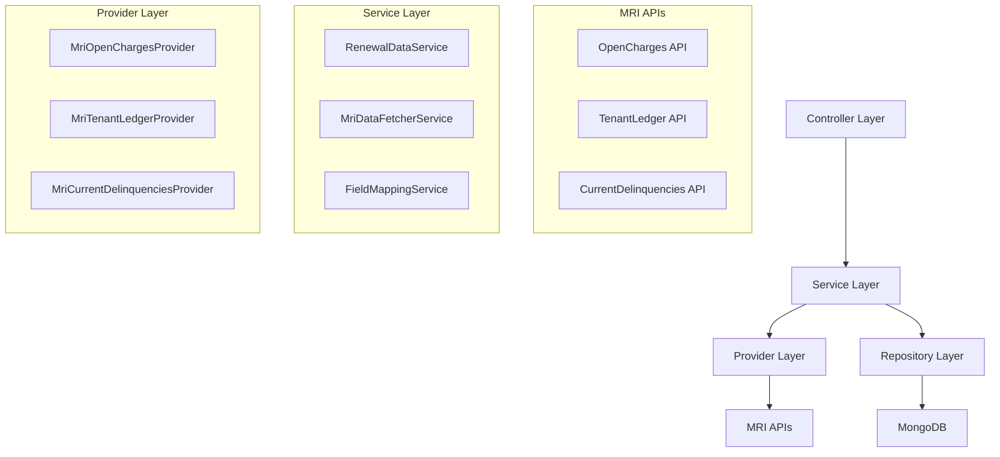

# Design Document: Renewal Data Storage

## Overview

The renewal-data-storage feature extends the existing renewals module to fetch, combine, and store data from three MRI APIs (OpenCharges, TenantLedger, and CurrentDelinquencies). The system will integrate seamlessly with the existing NestJS architecture, following established patterns for API integration, data processing, and storage.

The feature will provide a unified interface for accessing renewal data that combines financial information (charges, payments, balances) with delinquency data, enabling comprehensive renewal reporting and analysis.

## Architecture

The system follows a layered architecture pattern consistent with the existing NestJS application:



### Integration Points

- **Existing Renewals Module**: Extends the current renewal entity and services
- **MRI Integration Module**: Leverages existing MRI API configuration and patterns
- **Database Module**: Uses existing MongoDB connection and schema patterns
- **Queue System**: Utilizes existing BullMQ for background processing

## Components and Interfaces

### Core Services

#### RenewalDataService
Primary service orchestrating the data fetching, mapping, and storage process.

```typescript
interface RenewalDataService {
  fetchAndStoreRenewalData(filters: RenewalDataFilters): Promise<RenewalDataResult>;
  getRenewalData(query: RenewalDataQuery): Promise<RenewalDataResponse>;
  syncRenewalDataForProperty(propertyId: string): Promise<SyncResult>;
}
```

#### MriDataFetcherService
Service responsible for coordinating API calls to all three MRI endpoints.

```typescript
interface MriDataFetcherService {
  fetchAllRenewalData(buildingIds: string[]): Promise<CombinedMriData>;
  fetchOpenCharges(buildingIds: string[]): Promise<OpenChargesData[]>;
  fetchTenantLedger(buildingIds: string[]): Promise<TenantLedgerData[]>;
  fetchCurrentDelinquencies(buildingIds: string[]): Promise<CurrentDelinquenciesData[]>;
}
```

#### FieldMappingService
Service that maps and combines data from multiple API sources into unified renewal data.

```typescript
interface FieldMappingService {
  mapRenewalData(combinedData: CombinedMriData): Promise<MappedRenewalData[]>;
  validateMappedData(data: MappedRenewalData): ValidationResult;
}
```

### Data Providers

#### MriOpenChargesProvider
```typescript
interface MriOpenChargesProvider {
  getOpenCharges(buildingIds: string[]): Promise<OpenChargesResponse>;
}
```

#### MriTenantLedgerProvider
```typescript
interface MriTenantLedgerProvider {
  getTenantLedger(buildingIds: string[]): Promise<TenantLedgerResponse>;
}
```

#### MriCurrentDelinquenciesProvider
```typescript
interface MriCurrentDelinquenciesProvider {
  getCurrentDelinquencies(buildingIds: string[]): Promise<CurrentDelinquenciesResponse>;
}
```

### Repository Layer

#### RenewalDataRepository
Extends the existing RenewalRepository to handle the additional renewal data fields.

```typescript
interface RenewalDataRepository extends RenewalRepository {
  saveRenewalData(data: MappedRenewalData[]): Promise<SaveResult>;
  findRenewalDataByQuery(query: RenewalDataQuery): Promise<RenewalDataDocument[]>;
  updateRenewalData(leaseId: string, data: Partial<MappedRenewalData>): Promise<UpdateResult>;
}
```

## Data Models

### Extended Renewal Entity

The existing Renewal entity will be extended with additional fields for the MRI API data:

```typescript
// Additional fields to be added to existing Renewal entity
interface RenewalDataFields {
  // Financial Data from APIs
  monthlyRent?: number;           // From TenantLedger (IncomeCategory = RNT Base Rent)
  cam?: number;                   // From OpenCharges (IncomeCategory = CAM)
  insurance?: number;             // From OpenCharges (IncomeCategory = INS)
  tax?: number;                   // From OpenCharges (RentTaxAmount)
  totalDueMonthly?: number;       // From OpenCharges (TransactionAmount)
  balanceForward?: number;        // From TenantLedger (OpenAmount before month)
  cashReceived?: number;          // From TenantLedger (payment transactions sum)
  balanceDue?: number;            // From OpenCharges (OpenAmount)
  
  // Aging Buckets from CurrentDelinquencies
  days0To30?: number;             // ThirtyDayDelinquency
  days31To60?: number;            // SixtyDayDelinquency
  days61Plus?: number;            // NinetyDayDelinquency/NinetyPlusDayDelinquency
  
  // Metadata
  mriDataSources?: string[];      // Which APIs provided data
  lastMriSync?: Date;             // When MRI data was last synced
  mriDataQuality?: DataQualityScore; // Data completeness/quality metrics
}
```

### API Response Types

```typescript
interface OpenChargesData {
  BuildingID: string;
  LeaseID: string;
  TransactionID: string;
  Description: string;
  TransactionAmount: number;
  OpenAmount: number;
  IncomeCategory: string;
  IncomeCategoryDescription: string;
  PendingAmount: number;
  CashType: string;
  TransactionDate: string;
  Period: string;
  RentTaxAmount: number;
  // ... other fields as documented
}

interface TenantLedgerData {
  TransactionID: string;
  BuildingID: string;
  LeaseID: string;
  TransactionDate: string;
  IncomeCategory: string;
  SourceCode: string;
  CashType: string;
  Description: string;
  TransactionAmount: number;
  OpenAmount: number;
  Period: string;
  // ... other fields as documented
}

interface CurrentDelinquenciesData {
  BuildingID: string;
  LeaseID: string;
  SuiteID: string;
  OccupantName: string;
  ThirtyDayDelinquency: number;
  SixtyDayDelinquency: number;
  NinetyDayDelinquency: number;
  NinetyPlusDayDelinquency: number;
  DelinquentAmount: number;
  TotalDelinquency: number;
  // ... other fields as documented
}
```

### Combined Data Types

```typescript
interface CombinedMriData {
  buildingId: string;
  leaseId: string;
  openCharges: OpenChargesData[];
  tenantLedger: TenantLedgerData[];
  currentDelinquencies: CurrentDelinquenciesData[];
}

interface MappedRenewalData {
  buildingId: string;
  leaseId: string;
  monthlyRent?: number;
  cam?: number;
  insurance?: number;
  tax?: number;
  totalDueMonthly?: number;
  balanceForward?: number;
  cashReceived?: number;
  balanceDue?: number;
  days0To30?: number;
  days31To60?: number;
  days61Plus?: number;
  dataQuality: DataQualityScore;
  sourceTimestamp: Date;
}
```

## Correctness Properties

*A property is a characteristic or behavior that should hold true across all valid executions of a system-essentially, a formal statement about what the system should do. Properties serve as the bridge between human-readable specifications and machine-verifiable correctness guarantees.*

Now I need to use the prework tool to analyze the acceptance criteria before writing the correctness properties:

### Converting EARS to Properties

Based on the prework analysis, I'll convert the testable acceptance criteria into universally quantified properties, combining related properties to eliminate redundancy:

**Property 1: API Response Structure Completeness**
*For any* valid building and lease ID combination, when requesting data from any MRI API (OpenCharges, TenantLedger, or CurrentDelinquencies), the response should contain all required fields as specified in the API documentation
**Validates: Requirements 1.1, 1.2, 1.3**

**Property 2: API Error Handling Resilience**
*For any* API request that fails, the system should return a descriptive error message, continue processing other APIs, and validate successful response structures against expected schemas
**Validates: Requirements 1.4, 1.5**

**Property 3: Field Mapping Correctness**
*For any* valid API response data, the field mapper should correctly map income categories to their corresponding renewal fields (RNT Base Rent → Monthly Rent, CAM → CAM field, INS → Insurance field, etc.)
**Validates: Requirements 2.1, 2.2, 2.3, 2.8, 2.9, 2.10, 2.11**

**Property 4: OpenCharges Data Mapping**
*For any* OpenCharges API response, the system should map RentTaxAmount to Tax field and TransactionAmount to Total Due Monthly field
**Validates: Requirements 2.4, 2.5**

**Property 5: Temporal Data Processing**
*For any* TenantLedger data with periods before the current month, the system should map OpenAmount to Balance Forward, and for payment transactions, should sum all payment amounts to create Cash Received
**Validates: Requirements 2.6, 2.7**

**Property 6: Data Storage Completeness**
*For any* valid mapped renewal data, the storage service should persist all mapped fields along with metadata (timestamps, sync information) to the database
**Validates: Requirements 3.1, 3.2**

**Property 7: Duplicate Data Handling**
*For any* renewal data with the same BuildingID and LeaseID, the storage service should update existing records rather than create duplicates while maintaining referential integrity
**Validates: Requirements 3.3, 3.4**

**Property 8: Storage Error Handling**
*For any* data storage operation that fails, the system should log detailed error information and return appropriate failure status
**Validates: Requirements 3.5**

**Property 9: Query Functionality**
*For any* valid query parameters (BuildingID, LeaseID, or date filters), the system should return correct renewal records in consistent JSON format with all mapped fields
**Validates: Requirements 4.1, 4.2, 4.3, 4.4**

**Property 10: Empty Result Handling**
*For any* query that matches no records, the system should return an empty result set with appropriate metadata
**Validates: Requirements 4.5**

**Property 11: Cross-API Data Consistency**
*For any* lease with data from multiple APIs, the system should validate that BuildingID and LeaseID match across all sources
**Validates: Requirements 5.1**

**Property 12: Data Validation and Normalization**
*For any* API data with invalid values, inconsistent date formats, or non-numeric data, the system should normalize dates to ISO 8601, convert numeric fields appropriately, and log validation warnings with default values
**Validates: Requirements 5.2, 5.3, 5.4**

**Property 13: Incomplete Data Handling**
*For any* API response missing required fields, the system should mark records as incomplete and log the missing fields
**Validates: Requirements 5.5**

**Property 14: API Response Format Consistency**
*For any* API endpoint in the renewal data storage feature, responses should follow the existing application's API response format and error handling patterns
**Validates: Requirements 6.3**

**Property 15: Retry and Error Recovery**
*For any* failed MRI API call, the system should retry up to 3 times with exponential backoff, handle rate limits with appropriate throttling, and log detailed error information with processing context
**Validates: Requirements 7.1, 7.2, 7.3**

**Property 16: Validation Error Messaging**
*For any* data validation failure, the system should provide specific error messages indicating which fields and validation rules failed
**Validates: Requirements 7.4**

**Property 17: Health Check Reporting**
*For any* system health check request, the system should report MRI API connectivity status and data freshness metrics
**Validates: Requirements 7.5**

## Error Handling

The system implements comprehensive error handling at multiple levels:

### API Level Error Handling
- **Connection Failures**: Retry with exponential backoff (3 attempts)
- **Rate Limiting**: Implement throttling and respect API rate limits
- **Invalid Responses**: Validate response schemas and handle malformed data
- **Timeout Handling**: Configure appropriate timeouts for each API endpoint

### Data Processing Error Handling
- **Mapping Errors**: Log validation warnings and use default values
- **Type Conversion Errors**: Handle non-numeric data gracefully
- **Missing Fields**: Mark records as incomplete with detailed logging
- **Date Format Issues**: Normalize to ISO 8601 with fallback handling

### Storage Error Handling
- **Database Connection Issues**: Implement connection retry logic
- **Constraint Violations**: Handle duplicate key errors with upsert logic
- **Transaction Failures**: Implement rollback mechanisms for batch operations

### API Response Error Handling
- **Consistent Error Format**: Follow existing application error response patterns
- **Detailed Error Messages**: Provide specific field-level validation errors
- **Error Codes**: Use appropriate HTTP status codes and custom error codes

## Testing Strategy

The renewal-data-storage feature will use a dual testing approach combining suite tests and property-based tests for comprehensive coverage.

### Property-Based Testing

Property-based tests will validate the universal properties identified above using a minimum of 100 iterations per test. Each property test will be tagged with the format: **Feature: renewal-data-storage, Property {number}: {property_text}**

**Property Test Configuration:**
- **Library**: Use fast-check for TypeScript property-based testing
- **Iterations**: Minimum 100 iterations per property test
- **Generators**: Create custom generators for MRI API response data
- **Shrinking**: Enable automatic test case shrinking for failure analysis

**Key Property Test Areas:**
- API response structure validation with generated building/lease IDs
- Field mapping correctness with various income category combinations
- Data storage operations with generated renewal data sets
- Query functionality with random filter combinations
- Error handling with simulated failure scenarios

### suite Testing

suite tests will focus on specific examples, edge cases, and integration points:

**Core suite Test Areas:**
- Specific field mapping examples for each income category
- Edge cases for date processing and temporal logic
- Error scenarios with specific API failure modes
- Database integration with known test data sets
- Authentication and authorization integration points

**Integration Testing:**
- End-to-end API workflows with real MRI API responses
- Database transaction handling and rollback scenarios
- Queue processing for background sync operations
- Cache invalidation and data consistency checks

### Test Data Management

**Mock Data Generation:**
- Create realistic MRI API response generators
- Generate test data covering all income categories and scenarios
- Include edge cases like missing fields, invalid data types, and date format variations

**Test Database:**
- Use separate test database with known data sets
- Implement database seeding for consistent test environments
- Clean up test data between test runs

The testing strategy ensures both comprehensive input coverage through property-based testing and specific scenario validation through suite tests, providing confidence in system correctness and reliability.